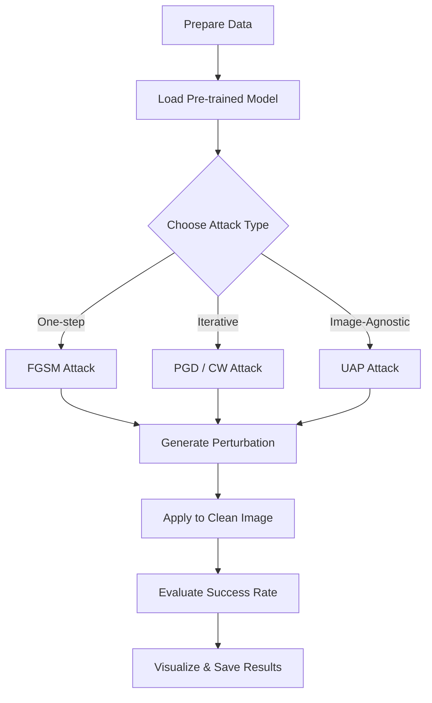

# Adversarial Attacks on CNN Architectures (Targeted & Untargeted)

This repository contains implementations of various state-of-the-art adversarial attacks on Convolutional Neural Network (CNN) models, specifically **VGG19** and **ResNet50**. The project explores both **Targeted** (forcing the model to predict a specific wrong class) and **Non-Targeted** (forcing any wrong prediction) attacks.

This work was developed during an internship at **IIT Bhilai**, focusing on the vulnerability of deep learning models to carefully crafted perturbations.

---

## 🚀 Key Features

- **Multiple Attack Algorithms**: Implementation of FGSM, PGD, C&W, and Universal Adversarial Perturbations.
- **Support for Major Models**: Tested on VGG19 and ResNet50 architectures.
- **Targeted & Untargeted Modes**: Flexibilty to test different adversarial goals.
- **Visualization**: Built-in plotting tools to compare Original vs. Adversarial images with their predicted labels.
- **Automated Saving**: Scripts automatically save original and attacked images for further analysis.

---

## 🛠️ Implemented Attacks

### 1. Fast Gradient Sign Method (FGSM)
A fast, one-step attack that adds a perturbation in the direction of the gradient of the loss function.
- **Files**: `fgsm untargted attack.py`, `fgsm targted attack.py`

### 2. Projected Gradient Descent (PGD)
A powerful iterative attack that is essentially an iterative version of FGSM with a projection step to keep the perturbation within an $\epsilon$-ball.
- **Files**: `pgd  nontargted Attack.py`, `pgd targted attack.py`, `pgd non targted Attack for visualization.py`

### 3. Carlini & Wagner (C&W) L2 Attack
A strong optimization-based attack that finds the minimal perturbation required to cause misclassification by minimizing a objective function combining L2 distance and a classification loss.
- **Files**: `carlini and wagner attack untargted attack.py`, `carlini and wagner attack targted attack.py`

### 4. Universal Adversarial Perturbations (UAP)
Finds a single image-agnostic perturbation that, when added to ANY image from a dataset, causes it to be misclassified with high probability.
- **Files**: `universal pertubution untargted attack.py`, `universal targted attack.py`

---

## 🏗️ Model Architecture

The attacks are primarily demonstrated on:
- **VGG19**: Modified with a custom fully connected layer to fit the specific dataset (e.g., 990 classes).
- **ResNet50**: Used as a victim model for robustness testing.
- **MobileNetV2**: A lightweight architecture optimized for mobile and edge devices.
- **EfficientNet**: A scalable architecture that achieves state-of-the-art accuracy with significantly fewer parameters.

The models are typically loaded with pre-trained weights or custom state dicts, and put into `.eval()` mode to ensure deterministic behavior during attack generation.

---

## 📋 Prerequisites

To run these scripts, you need:
- Python 3.8+
- PyTorch
- Torchvision
- NumPy
- Matplotlib
- PIL (Pillow)

Install dependencies via pip:
```bash
pip install torch torchvision numpy matplotlib pillow
```

---

## 📖 Usage

Each script is self-contained. To run an attack, ensure your dataset path is correctly set in the script and execute:

```bash
python "pgd  nontargted Attack.py"
```

### Configuration Parameters
You can adjust the following parameters within the scripts:
- `epsilon`: Maximum perturbation allowed.
- `alpha`: Step size for iterative attacks (PGD/FGSM).
- `num_iter`: Number of iterations for the attack.
- `target_class`: The desired label for targeted attacks.

---

## � Project Workflow

The following diagram illustrates the typical research and execution workflow within this repository:



### Step-by-Step Procedure:
1.  **Data Preparation**: Organize the dataset (e.g., ImageNet split) into `train/` and `test/` folders.
2.  **Model Configuration**: Load the desired CNN architecture (VGG19 or ResNet50) and modify the final layer if necessary.
3.  **Attack Selection**: Choose between Targeted or Untargeted scripts based on your research goal.
4.  **Parameter Tuning**: Adjust hyperparameters like `epsilon`, `alpha`, and `num_iter` for optimal results.
5.  **Execution**: Run the Python script. The model will process a batch of images and apply the chosen attack.
6.  **Validation**: Inspect the generated plots to verify if the model's prediction was successfully flipped.
7.  **Saving Results**: Original and attacked images are exported to relevant folders for documentation.

---

## �📊 Results & Visualization

The scripts provide a success rate for each attack and generate comparative plots.

| Original Image | Adversarial Image |
| :---: | :---: |
| Predicted: **Dog** (Correct) | Predicted: **Cat** (Misclassified) |

Adversarial images are saved in directories like `pgdAttackimage/`, `fgsmAttackedimage/`, etc., alongside the original images for benchmarking.

---

## 🤝 Acknowledgments

- Special thanks to **IIT Bhilai** for the internship opportunity.
- Project developed by [Kshitij Sinha](https://github.com/Kshitij19ji).
